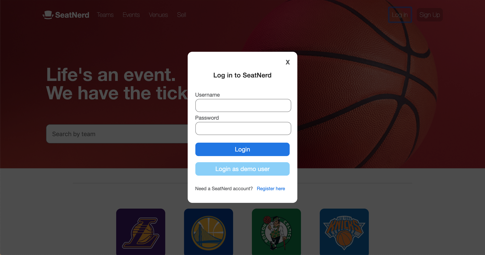

# SeatNerd

SeatNerd is a web app for buying and selling tickets for sporting events. The
app is based on SeatGeek. SeatNerd uses Ruby on Rails for the backend with 
React and Redux for the frontend.

[Live Demo](https://seatnerd.herokuapp.com/#/)

## Technologies

* Ruby on Rails
* ActiveRecord
* PostgreSQL
* React
* Redux
* BCrypt

## Features

* Logged-in users are able to list tickets they own up on the SeatNerd
marketplace. If not logged in, the sell button will open up a modal, prompting
the user to log in to their account.
* Users can find tickets to events by selecting the venue of their choice or 
their team of choice. Alternatively, users can simply view an index of all the
events available on SeatNerd.
* Users can search by team to find events involving that particular team.
* Logged-in users can choose to update the price of their ticket listing or remove the listing from the marketplace altogether.

## Screenshots

### Splash Page
The SeatNerd splash page features links to login/signup and a search bar that allows users to search for events by team.

### Login Page
SeatNerd implements custom user authentication, using BCrypt for password hashing, to allow registered users to securely manage their ticket listings and make transactions. 

### Ticket Listings
When attempting to purchase a ticket, if a user is not logged in, the user will be prompted to login or create an account.

## Future Plans

* Allow users to bookmark events.
* Give users event recommendations based on their favorite team and current
location.

